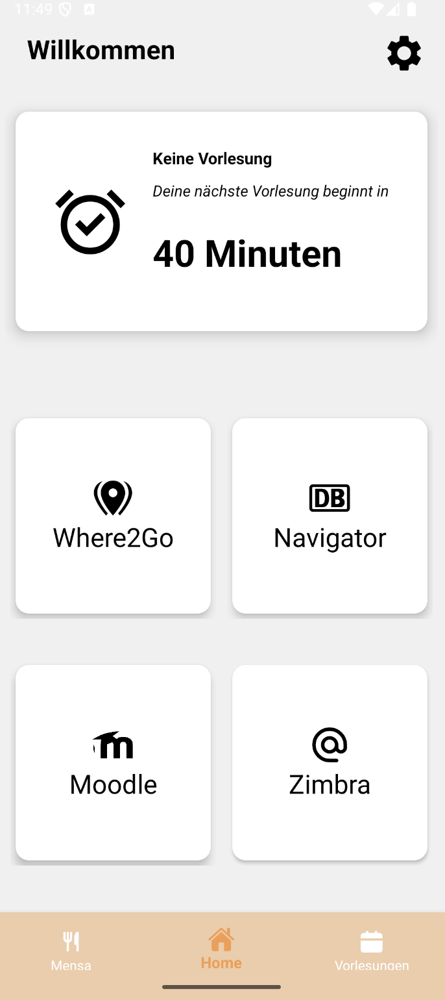
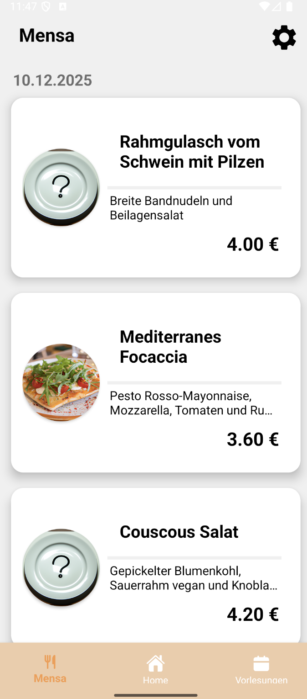
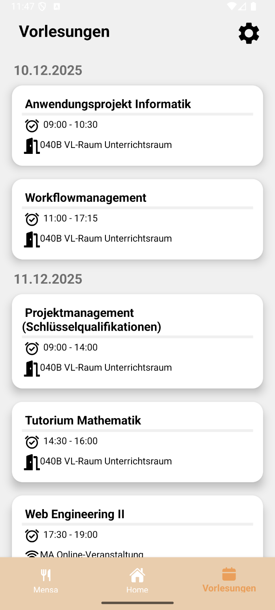

<h3 style="text-align: center;">SAFT</h3>

Student • Anxiety and • Fear • Treatment

---

 
Student Anxiety and Fear Treatment (SAFT) is an Android application build as a student project to bundle essential information and resources for first semester students at DHBW Mannheim.

### ⚠️ Project Status ⚠️
This project is no longer actively maintained, as the development for the university course has been completed.  
The repository remains available for reference and educational purposes.

### Features
- **Where2Go** & **Navigator**: *Where2Go* displays a map with points of interest in Mannheim, while *Navigator* shows realtime arrivals and departures at the “Duale Hochschule” stop. Both features are integrated through WebViews.
- **Lectures**: Displays today’s and upcoming lectures, including details such as room number, start and end time.
- **Mensa**: Shows the meals offered at the university cafeteria.
- **Settings**: Allows users to change or configure their course.

### Main pages

<table style="margin: 0 auto;">
    <tr>
        <td></td>
        <td></td>
        <td></td>
    </tr>
</table>
